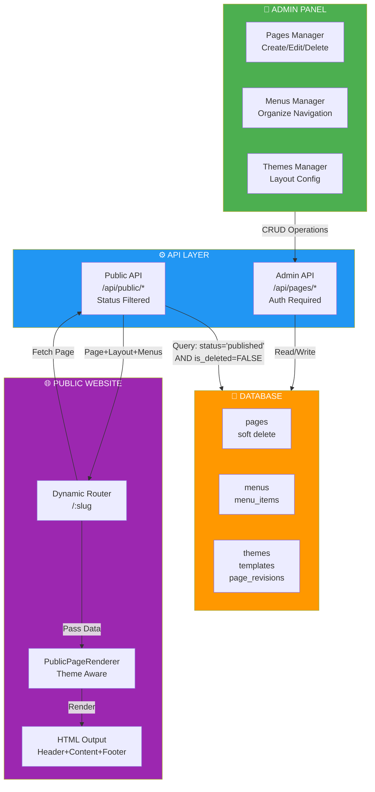

---

## 📋 Complete CMS Lifecycle Flow

```mermaid
stateDiagram-v2
    [*] --> Create: Admin creates page
    
    Create --> Draft: status='draft'<br/>is_deleted=FALSE
    
    Draft --> Draft: Admin edits
    Draft --> Published: Publish button<br/>status='published'<br/>published_by set<br/>published_at set
    Draft --> Deleted: Delete button<br/>Soft Delete
    
    Published --> Published: Admin edits
    Published --> Archived: Archive<br/>status='archived'
    Published --> Deleted: Delete button<br/>Soft Delete
    
    Archived --> Published: Republish
    Archived --> Deleted: Delete button<br/>Soft Delete
    
    Deleted --> Draft: Restore button<br/>is_deleted=FALSE<br/>status='draft'
    
    Published -.->|Visible in| PublicWeb["🌐 Public Website"]
    Archived -.->|Hidden from| PublicWeb
    Draft -.->|Hidden from| PublicWeb
    Deleted -.->|Completely Hidden| PublicWeb
```

---

## 🔍 Query Logic

### Admin View (All Statuses)
```sql
SELECT * FROM pages 
WHERE website_id = ? AND is_deleted = FALSE
ORDER BY created_at DESC
```
Shows: draft, published, archived (not deleted)

### Public View (Published Only)
```sql
SELECT * FROM pages 
WHERE website_id = ? 
  AND status = 'published' 
  AND is_deleted = FALSE
```
Shows: published pages only

### Menu Items (Published Pages Only)
```sql
SELECT * FROM menu_items mi
LEFT JOIN pages p ON p.id = mi.page_id
WHERE p.status = 'published' 
  AND p.is_deleted = FALSE
```
Auto-hides deleted/unpublished pages from menus

---

## 📊 Data Flow Diagram

```
User Action                Database Change              Public Impact
─────────────             ─────────────────            ──────────────

Create page         →    INSERT pages
(draft)                 status='draft'
                        is_deleted=FALSE

                        Page in admin
                        NOT on website  ✅

Publish page        →    UPDATE pages
                        status='published'
                        published_by=X
                        published_at=NOW()

                        Page in admin
                        ON website      ✅

Edit content        →    UPDATE pages content
                        updated_by=X
                        updated_at=NOW()

                        Visible immediately
                        on public site   ✅

Delete page         →    UPDATE pages
(SOFT DELETE)           is_deleted=TRUE
                        deleted_at=NOW()
                        deleted_by=X
                        status='deleted'

                        Hidden from admin
                        REMOVED from website
                        AUTO-REMOVED from menus ✅

Restore page        →    UPDATE pages
                        is_deleted=FALSE
                        deleted_at=NULL
                        deleted_by=NULL
                        status='draft'

                        Back in admin
                        NOT on website (draft)
                        Data preserved   ✅
```
